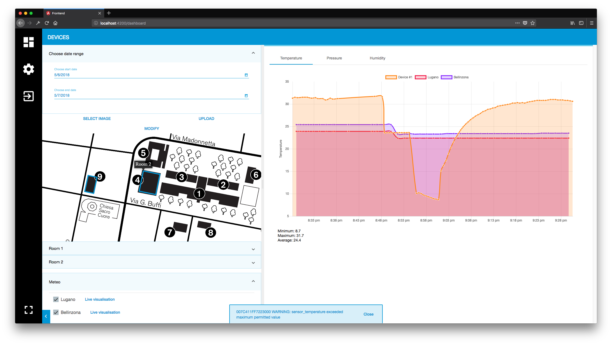

# LoRa-net-manager

## LoRaWAN manager on top of Gotthardps LoRaWAN server

This project helps to manage a LoRaWAN network. In the dashboard page it is possible to monitor sensor data.\
It runs on top of the amazing work of [Petr Gotthard](https://github.com/gotthardp/lorawan-server).



## Used technologies

- [Docker](https://www.docker.com)
- [Gotthardps LoRaWAN server](https://github.com/gotthardp/lorawan-server)
- [Konva.js](https://konvajs.github.io)

## Built with

- [Nest](https://nestjs.com) backend
- [Angular](https://angular.io) frontend

## Features

It makes data logging with LoRaWAN easy and fun.
Data can be visualised as a graph, also in realtime.

## Requirements

- Class A LoRa devices supporting OTAA. Works perfectly with the [Arduino-LMIC library](https://github.com/matthijskooijman/arduino-lmic)
- Data payload sent to gateway has to be in the format of Cayenne Low Power Payload (LPP). The [LPP](https://www.thethingsnetwork.org/docs/devices/arduino/api/cayennelpp.html) library can be used.
- A LoRaWAN gateway running the [packet_forwarder](https://github.com/Lora-net/packet_forwarder) software
- [Node.js](https://nodejs.org) with npm installed

## Installation

**Backend** `cd source/backend/ && npm install`

**Frontend** `cd source/frontend/ && npm install`

> Note: in Windows [Gotthardps LoRaWAN server](https://github.com/gotthardp/lorawan-server) has to be installed manually

## How to use

When running the backend for the first time, it will guide you through the installation of Docker (on UNIX based operating systems).

**Backend** `cd source/backend/ && npm run start`

**Frontend** `cd source/frontend/ && npm start`

## Payload format

Format of data received in the backend when an uplink is received

```
interface DataWS {
  deveui: string;   // DevEUI of device
  devaddr: string;  // DevAddr of device
  battery: number;  // value from 0-255
  data: string;     // payload in hex
  datetime: string; // time of arrival
  rssi: number;     // RSSI noise
  field1: number;   // temperature sensor
  field2: number;   // pressure sensor
  field3: number;   // humidity sensor
  field4: number;   // moisture sensor
  field5: boolean;  // CO2 sensor
  field6: boolean;  // magnetic sensor
  field7: boolean;  // pir sensor
}
```

> Make sure to assign sensor readings to the LPP object with the correct field number

## Tested with

- Node.js v8.10.0
- npm v5.6.0

## License

MIT